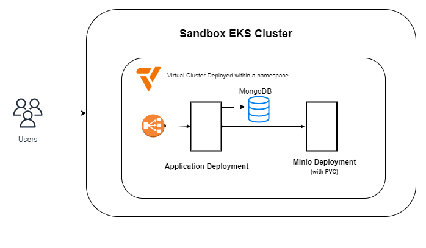

# Knote-js Demo

## Introduction
This repository contains a architecture for a scalable and secure Knote-js - a Node application with proper GitOps practices in-place.

**High-level Components**:
1. **Application:** A statically built Node.js app which includes both frontend and backend functionalities.
2. **MongoDB:** A mongodb service that operates as a persistence layer for the server
3. **Minio:** a high-performance, S3 compatible object storage.

## Running Demo
http://a47cb6e9ec97a46a6945962e8867af93-918063790.us-west-2.elb.amazonaws.com/

## Architecture

High Level Architecture Diagram

**NOTE**
- HPA is enabled on Application and Minio deployments
- (optional) Multi-region EKS clusters could be used to support wide geographies
 
## Local Setup & Testing

Refer to this [README.md](application/README.md) for details related to the codebase and local setup

## Infra Setup and Initial Deployment

Refer to this [README.md](docs/initial-setup.md) for details related to infra setup and deployment

## CI-CD

### Tools/Services used:
- Cloud: [AWS](https://aws.amazon.com/)
- Container Registry: [Dockerhub](https://hub.docker.com/)
- CI/CD Tools: [Github Action](https://github.com/features/actions) and [ArgoCD](https://argo-cd.readthedocs.io/en/stable/)

### Required Github Secrets:
- `DOCKER_USER`: username for dockerhub
- `DOCKER_PASSWORD`: password for dockerhub - used to upload docker images
- `DOCKER_REGISTRY`: name of docker registry
- `AWS_ACCESS_KEY_ID`: Key Id with access to sandbox cluster in which ephemeral environment should be deployed
- `AWS_SECRET_ACCESS_KEY`: Secret Key with access to sandbox cluster in which ephemeral environment should be deployed
- `EKS_CLUSTER_NAME`: AWS EKS sandbox cluster name 

### Production/Acceptance environment deployment

#### Pipeline Design

- **Prod Deployment Pipeline**: `.github/workflows/prod-release.yaml` generates new dockerimage, push to dockerhub and updates image tag in values.prod.yaml
- **Acceptance Deployment Pipeline**: `.github/workflows/acceptance-release.yaml` generates new dockerimage, push to dockerhub and updates image tag in values.acceptance.yaml

**NOTE**: Make sure "AutoSync" is enabled in ArgoCD for these application project

### Ephemeral deployment

This pipeline would be triggered whenerver a PR is created. This is useful for developers, QA, or Managers when there is a requirement of short-lived environments that can be used to test the changes included in that PR.

#### Pipeline Design

#### Infra Architecture Design

**NOTES**:
- self-managed deployments for `MongoDB` have been used to save cost
- [vCluster](https://www.vcluster.com/) has been used to provide light-weight isolated environment that can be used to deploy short-lived ephemeral environments.

- **Deploy Ephemeral Environment**: `.github/workflows/pr-open.yaml` generates new dockerimage, push to dockerhub and deploys ephemeral environment. This github action is triggered whenever a PR againstis created or updated. This pipeline outputs the URL to ephemeral deployment in the PR comment.

- **Destroy Ephemeral Environment**: `.github/workflows/pr-close.yaml` destroys ephemeral environment. This github action is triggered whenever a PR has been merged or closed.

## Next Steps

**NOTE:** The below mentioned points are not implemented in this demo but can be easily integrated by following proposed designs and architecture.

### Multi Region AWS EKS

Advantages:
- Use of multi-region architecture to support disaster recovery
- Serve applications requests closer to your customer's location thereby, speedup read processes

Solution:
- Deploy EKS clusters in multiple regions
- Connect multiple AWS Regions over private network using inter-region VPC peering
- Use AWS Global Accelerator to distribute traffic to Kubernetes-hosted applications that run in multiple AWS Region
- Here we can use a primary region that actively serves traffic and a second region that acts as failover

- We can update our application CI/CD to deploy application to all the clusters

### Database Disaster Recovery

Solution:
- Use AWS DocumentDB Global Clusters
- Create one primary and multiple secondary regions
- Usually the replication between primary and secondary clusters is within seconds
- In case of a disaster i.e. primary region is not working, we can upgrade any secondary cluster to become a standalone or global cluster therefore, it can now be used to serve requests.

#### DocumentDB Global Cluster

#### DocumentDB DR Procedure
Architecture:
- DocumentDB Global Clusters have been used with atleast 2 regional clusters - (one primary and other secondary)
- The endpoint used by application to connect with database is a CNAME pointing to primary cluster and is stored in Route53
- Cloudwatch alerts are created to trigger a event if disaster occurs example: if database is not responding for few minutes
- Lambda functions are created to automatically switch to secondary regional cluster
- DynamoDB is used to track progress of a DR process 

Steps:
- In case of disaster, cloudwatch will trigger a event which will invoke a Lambda function
- `failoverToSecondary` Lambda function does following steps:
  - Removes secondary cluster from global cluster pool (takes 1-2 minutes)
  - Promotes secondary cluster as a standalone cluster (takes 1-2 minutes)
  - Updates entry in Route53 
  - DNS propogation happens with new value for CNAME (time may vary but usually is done in 2-3 minutes)
- Application is now able to connect with newly promoted cluster & can continue to operate as usual
- Once evrything is operational, we can trigger `convertRegionalClusterToGlobal` lambda
  - It is responsible to make the standalone cluster to a Global Cluster
  - It adds new seconday clusters in different regions therefore, providing HA 

### Monitoring Metrics

- Proposed Monitoring Tool: [Prometheus](https://prometheus.io/)
- Complete Monitoring and Logging Stack: [Loki](https://grafana.com/oss/loki/), [Promtail](https://grafana.com/docs/loki/latest/clients/promtail/), [Prometheus](https://prometheus.io/), [Thanos](https://thanos.io/) and [Grafana](https://grafana.com/)

#### Metrics that can be useful to monitor the application & infrastructure stack

- **Cluster Level Monitoring**:
  - Nodes Metrics exported by EKS:
    - Ready, DiskPressure, MemoryPressure , PIDPressure, NetworkUnavailable
      - kube_node_info
      - kube_node_spec_unschedulable
      - kube_node_status_allocatable
      - kube_node_status_capacity
      - kube_node_status_condition
  - Cluster total CPU / MEM query
    - sum(kube_pod_container_resource_requests_cpu_cores) / sum(node:node_num_cpu:sum)
    - sum(kube_pod_container_resource_requests_memory_bytes) / sum(node_memory_MemTotal)
- **Application level**:
  - Pods
    - kube_pod_container_info
    - kube_pod_container_resource_requests
    - kube_pod_container_resource_limits
    - kube_pod_container_status_ready
    - kube_pod_container_status_terminated_reason
    - kube_pod_container_status_waiting_reason
    - kube_pod_status_phase
    - kube_node_status_allocatable_cpu_cores
    - kube_node_status_allocatable_memory_bytes

  - Deployment:
    - kube_deployment_spec_replicas
    - kube_deployment_status_replicas_available
    - kube_deployment_status_replicas_unavailable

  - Endpoint:
    - Internal API_Server:
      - apiserver_request_count
      - apiserver_request_latencies*
      - etcd_request_cache_get_latencies_summary*
      - etcd_request_cache_add_latencies_summary*
      - etcd_helper_cache_hit_count
      - etcd_helper_cache_miss_count
    - ALB
      - ActiveConnectionCount
      - HTTPCode_ELB_3XX_Count
      - HTTPCode_ELB_4XX_Count
      - HTTPCode_ELB_5XX_Count
      - ProcessedBytes
      - RequestCount
      - TargetResponseTime

## TODO / Future Improvements
- Support https in endpoints
- Setup multiple replicas of application in different nodes/zones for HA
- Add support for mTLS between frontend and backend
- Support to add CI/CD for IaC (Terraform)
- Integrate WAF 
- Add support for canary or blue/green rollouts
